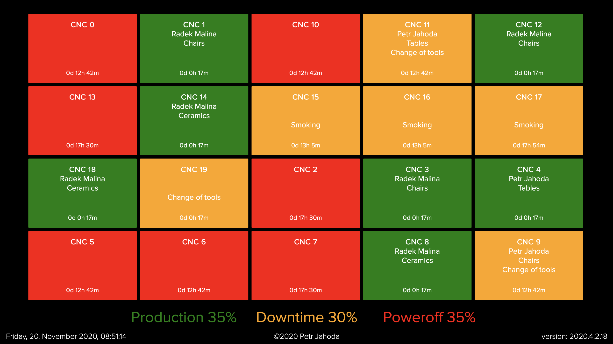

[](https://www.jetbrains.com/go/)
<br/>

[](https://github.com/petrjahoda/display_webservice/commits/master)
[](https://github.com/petrjahoda/display_webservice/issues)
<br/>


<br/>
[](https://hub.docker.com/r/petrjahoda/display_webservice)
[](https://hub.docker.com/r/petrjahoda/display_webservice/tags)
<br/>
[](https://www.postgresql.org) [](https://www.docker.com)

# Display WebService

## Description
Go web service, that shows web pages on port 81
* `/display_1` shows all workplaces with their statuses in small tiles

## Installation Information
Install under docker runtime using [this dockerfile image](https://github.com/petrjahoda/system/tree/master/latest) with this command: ```docker-compose up -d```

## Implementation Information
Check the software running with this command: ```docker stats```. <br/>
Display_webservice has to be running.

## Developer Information
Use software only as a [part of a system](https://github.com/petrjahoda/system) using Docker runtime.<br/>
 Do not run under linux, windows or mac on its own.

© 2020 Petr Jahoda

Example

