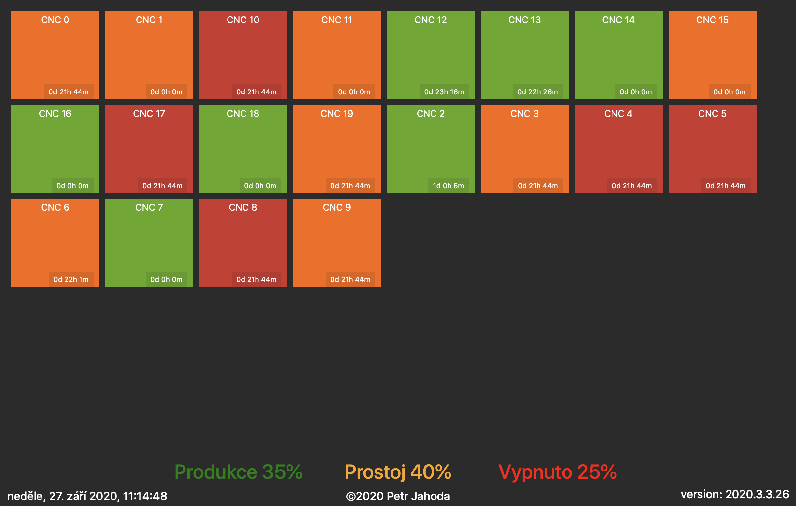

# Display WebService

## Description
Go service that shows web pages on port 81
* `/display_1` shows all workplaces with their status in small tiles
* `/display_2` shows all workplaces with their status in wide tiles

## Additional information
* ready to run in docker (linux, mac and windows service also available)
* using JSON config file for even better configurability

    
© 2020 Petr Jahoda

Example

